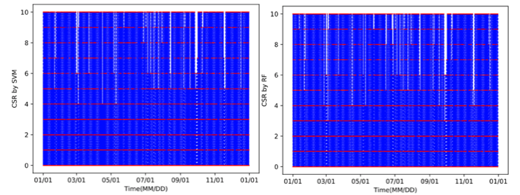
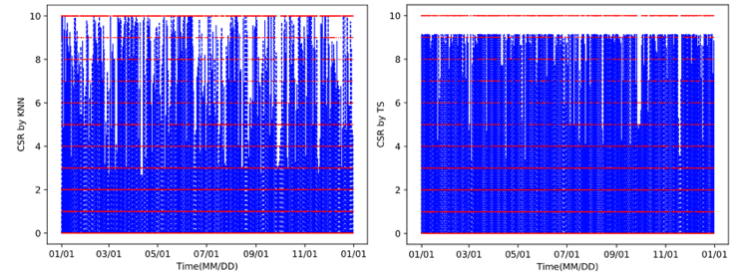
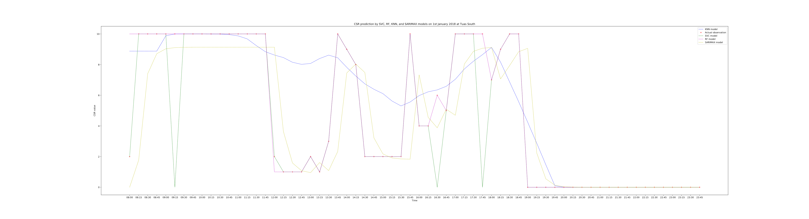

# Project Report 2.1

## Introduction

### Solar radiation[^24][^25]

When it comes to energy generation, solar power remains the most promising renewable energy source in Singapore. With an average solar irradiance of 1,580 kWh/(m^2^*year) and about 50% more solar radiation than temperate countries, solar photovoltaic (PV) generation has the greatest potential for wider deployment in Singapore.[^24] Moreover, a report by National Renewable Energy Lab [^25] has indicated that from 2010 to 2017 there has been approximately a 70% reduction in the total PV system hardware cost. Combining great potential and decreasing cost, there is a strong demand to deploy solar power widely in Singapore. Precise solar radiation prediction will be the key to successful integration of solar power.

### Available prediction tools[^4][^5][^33][^23]

In order to make accurate weather predictions, people have been coming up with all sorts of prediction methods. Most approaches are based on Numerical Weather Prediction (NWP) models, which solves differential equations to describe the dynamics in the atmosphere. Another type of prediction tools is based on statistical learning, which derives functional dependencies directly from the observations, also known as machine learning.

Currently, one of the most widely used weather prediction models based on NWP is known as Weather Research and Forecast (WRF) model[^42]. The model has been used in the weather forecast in the study[^20][^21] and has proved its reliability by its successful power output forecast in the context of Smart Grids and Renewable Energy on [^22]. The WRF model uses the computing power to make a forecast of many atmospheric variables such as temperature, pressure, wind, and rainfall. The core of the model is the mathematical models based on physical equations with all kinds of real-time data collected by different meteorological stations or weather satellites across the country as the input. By analyzing how the variables will interact with one another based on physical equations, the model will simulate the whole atmospheric environment and make predictions based on different requirements. For example, the WRF model can simulate the movement and thickness of the cloud and based on the real-time simulation, it can predict the solar potential of the region with very high accuracy because the environment simulated is very close to the actual world and they are based on the same physical principles.

The WRF model is commonly used to make short-term weather predictions and long-term climate predictions. One reason that restricts the WRF’s performance is the model requires very huge computing powers. Manipulating vast amounts of data and performing complex calculation requires some of the most powerful supercomputers in the world and it may still take huge amounts of time to complete the prediction.  Despite it is highly time-consuming and requires numerous computing power, the WRF model requires a huge amount of prior knowledge to interpret the computer forecast and because of this, very few people can operate the model to make the predictions as they want.

Due to the limitations of the WRF model, there is a strong demand to develop alternative methods to make the preidctions[^27] and that is where machine learning comes in. Machine Learning[^41], that research different algorithms, can learn information from the dataset and make a useful tool to predict the solar radiation with the much shorter time taken.[^23][^40] Essentially, various algorithms can accept a given set of training examples and derive a general trend over time.[^26] There are different machine learning algorithms, such as Support Vector Machine (SVM), Artificial Neural Network (ANN), K-Nearest Neighbours and Time series and so on.[^37] The focus of the study is to learn about the algorithms and apply them into this certain problem. 

## Methodology

### Data pre-processing

The whole dataset provided consists of solar-related data at 62 different locations across Singapore generated by the WRF model for the time period 1 Jan 2018, 8 am to 1 Jan 2019, 8 am. There are four columns in each dataset: Time, Direct Solar Radiation (SWDIR), Diffuse Solar Radiation (SWDIF) and Gradient Level Wind (GLW) and only first three columns are interested in this study. When both SWDIR and SWDIF are zero, it corresponds to the night time when there is no solar radiation at the location. 

In this study, the solar potential is measured by the clear-sky ratio (CSR), defined as 
$$
\text{CSR} = \frac{\text{SWDIR}}{\text{SWDIR}+\text{SWDIF}}
$$
where $\text{CSR}$ ranges from 0 to 1 by its definition. As Singapore has the very limited land area, if there is no cloud cover, the total amount of radiation from the sun is rather constant across the country and hence CSR can be an applicable measure of solar potential across the country. In order to represent the solar radiation intuitively, the CSR value has been divided into ten continuous even groups (Group 1 to Group 10) from 0 to 1, namely $0.0-0.1, 0.1-0.2, 0.2-0.3 … 0.9 - 1.0$. The $\text{CSR}$ values at night, which are expected to be $\text{NaN}$ (not a number) by its definition, are classified to Group 0, in order to maintain the continuity of the dataset. 

The whole dataset has been normalized in the mean and standard deviation. 
$$
X_\text{norm(i, j)} = \frac{X_{(i, j)}-\text{mean}(X_j)}{\text{std}(X_j)}
$$
where $X_j$ is the $j^{\text{th}}$ column of matrix $X$. After normalising the dataset, the mean becomes zero and has unit variance along each feature and can be less sensitive to the scale of features.

## Various Models Used

Machine learning models are able to learn from data based on different algorithms. In supervised learning, computers are usually presented with sample input and their desired outputs and the goal is to learn a general function that maps inputs to outputs[^3]. There are generally two types of models in supervised learning: classification and regression. Classification aims to identify which of a set of categories the new observation belongs to, on the bias of a training set of data containing observations with their category membership known and the purpose of regression models is more about estimating the relationship between a dependent variable and one or more independent variables, which means it can help people understand how the dependent variable changes when any one of the independent variables is varied. Both of the two kinds can contribute to making predictions of the solar radiation data and this section will introduce four different models with their algorithms.

#### Support Vector Classifier[^9][^10][^11][^12][^13][^28][^38]

Support Vector Machine algorithms (SVMs) are a set of supervised learning methods used for classification, regression and outlier detection. The objective of the algorithm is to find a hyperplane in an $N$-dimensional space ($N$ - the number of features) that distinctly classifies the data points.

As the figure above on the left suggests, there can be many possible hyperplanes available and the one with the maximum margin is to be found, i.e the maximum distance between data points of both classes shown in the figure on the right. Maximizing the margin distance reinforces the model and makes the future classification more reliable.

Hyperplanes refer to decision boundaries that contribute to classifying the data points. Data points falling on either side of the hyperplane can be attributed to corresponding classes. The dimension of the hyperplane is equal to $N-1$, where $N$ is the number of features. Support vectors are data points that are closer to the hyperplane and can influence the position and orientation of the hyperplane. With these support vectors, the margin of the classifier can be maximized.

#### Random Forest[^4][^5]

Random Forest algorithm usually includes three parts: Decision Tree, Feature Bagging and Ensemble of the result.

In the formation of a Decision Tree, the subsets of training data are randomly sampled with replacement and the target variable is fitted to regression models using each of the independent variables. The data is split at several split points for each independent variable. At each split point, the Sum of Squared Errors (SSE) between the predicted values and the actual values is calculated and compared against one another. The variable or point yielding the lowest SSE is hence chosen as the split point, also called the root node. The process, known as "bagging" method, recursively continues. Many regression Decision Trees are formed with several nodes in each tree and the ensemble of these decision trees is known as the "random forest".

The Random Forest method introduces more randomness and diversity by applying the bagging method to the features. Rather than search for the best predictors greedily to find new split points, it randomly samples elements from the predictors, thus increasing the diversity and reducing the variance of the trees while keeping bias high or even increasing. The process is known as “Feature Bagging” and can help make the model more robust.

In the prediction process, each new data point goes from the root node to the bottom until it is fitted to a function with all the different trees in the ensemble and the average prediction of each tree is used as the final result. The ensemble learning allows multiple algorithms to obtain better predictive performance than that from any constituent learning algorithm alone. By combing result of all the "trees" in the "forest" with ensemble learning, the more accurate prediction can be obtained.

#### K-Nearest Neighbours Regressor[^19]

The K-nearest neighbor regressor (KNN) is an algorithm that stores all available cases and makes the numerical prediction based on a similarity measure, e.g. distance function. KNN identifies the K-nearest neighbors by some distance metric and then average the value of these neighbors. The prediction is given by:
$$
\hat{Y} = \frac{1}{K} \sum_{i \in N_0}y_i
$$
Commonly for continuous variables, the distance used is the Euclidean distance given by:
$$
D = \sqrt{\sum_{i=1}^k (X_i - y_i)^2}
$$
Usually, it can be very helpful to give higher weights to the nearby points compared with faraway points and this can be achieved by assigning weights proportional to the inverse of the distance. 

#### Time-series model[^14][^15][^39]

 An important aspect of the time-series model is the concept of stationary processes. That means the autocorrelation and expectation of the overall dataset do not vary with time. Known the solar radiation has its seasonal variation pattern, the time-series can be employed to make the prediction. The model is known as Seasonal Auto-Regressive Integrated Moving Average with eXogenous regressors model (SARIMAX) and is very similar to a combination of the Auto-regressive model (AR) and the Moving Average model (MA) with additional seasonal terms.

The auto-regressive (AR) process is a regression term that the explanatory variable depends on historical values. The formula is given below:
$$
X_t-\sum_{i=1}^q ϕ_iX_{t-i} = Z_t
$$
In the equation, $q$ is chosen depending on the autocorrelation functions and an AR(1)-model correspond to $q=1$. In this context, $Z_t \sim WN(0, \sigma^2)$.

The Moving Average (MA) process is another regression form where the prediction parameter depends on external shocks rather than historical data. Formally, the process is defined as:
$$
X_t = \sum_{i=0}^p \theta_iZ_{t-i}
$$
Here, $Z_i \sim WN(0, \sigma^2)$ and $Z_i$ are independent for all $i$ and for $i=0$, $\theta_0=1$.

The seasonal terms make sense when the time series have a clearly seasonal pattern. The $ARIMA(p,d,q)(P,Q,D)_s$ is given by:
$$
\phi^p(B)\Phi^P(B^s)(|1-B)^d(1-B^s)^DX_t=\theta^q(B)\Theta^Q(B^s)Z_t
$$
where $\Phi^P(B^s) = 1-\Phi B^s-...-\Phi^PB^s$ and $\Theta^P(B^s)$ follows analogously. The $P$, $D$ and $Q$ have the same properties as the $p$, $d$ and $q$, which namely represent AR parameters, differences, and MA parameters, however with a seasonal step. Thus $D=1$ gives the seasonal difference for some seasonality $s$: $(1-B)^{1*s}X_t = X_t - X_{t-s}$.

## Analysis and Evaluation of the results[^28][^16][^17][^32]

### Mean Absolute Error

A common performance metric is the Mean Absolute Error (MAE), given by:
$$
MAE = \frac{\sum_{i=1}^n|y_i-\hat{y}_i|}{n} = \frac{\sum_{i=1}^n|e_i|}{n}
$$
where $y_i$ and $\hat{y}_i$ corresponds to the actual value of $y$ and predicted value of $y$ and $e_i=y_i-\hat{y}_i$. As the MAE sums up the absolute errors, it can reflect the overall error from the actual trend where all individual terms have equal weights.

### Mean Squared Error

Another common performance metric is the Mean Squared Error (MSE), given by:
$$
MSE = \frac{\sum_{i=1}^n (y_i - \hat{y}_i)^2}{n}
$$
Same as the MAE, the terms in the formula represent the exact same meanings. By summing up the squared errors, MSE gives the outliers a higher weight and can reflect the variation of each individual term.

### Root Mean Squared Error

Similar to the MSE, Root Mean Squared Error (RMSE) gives higher weight to outliers and is given by:
$$
RMSE = \sqrt{\frac{\sum_{i=1}^n (y_i - \hat{y}_i)^2}{n}}
$$
By finding the square root of MSE, the RMSE can be directly interpreted in terms of measurement units, and hence is a better measure of accuracy than a correlation coefficient or MSE. While giving higher weights to terms with large errors, which are particularly not desired outcomes, RMSE has a tendency to be increasingly larger than MAE as the sample size increases. This can be problematic and restricts the application of RMSE in this study given the total dataset which has the size of nearly 10^7^.

### Table of metrics and Analysis

<!--The table below contains the question about over-fitting, while both SVC and RFC have zero train error, SVC has 2.3256(this data is close to the random guess) MAE error and RFC has only 0.74600 MAE error. Other metrics indicate similar information. Then here comes the question: is our engineering goal to recreate the data based on the data from the WRF model or we should be able to make predictions? If the first one, then the SVC can be a great choice, but if the second one, there is no question that SVC has the problem of over-fitting and should be going through the regulation process. From the data provided, the goal seems to be the first one, while based on the abstract and many documents I have written so far, the goal is more likely to be the latter. And that is my question.--> <!--'ll assume that our engineering goal is the first one, as we are not really making predictions of future solar radiation, but simulate the data based on the WRF data provided.-->

| Model Name                          | Mean Absolute Error (MAE) | MAE percentage ($\%$) | Mean Squared Error (MSE) | Root Mean Squared Error (RMSE) | RMSE percentage ($\%$) |
| ----------------------------------- | ------------------------- | --------------------- | ------------------------ | ------------------------------ | ---------------------- |
| Support Vector Classifier (SVC)     | 0.58096/0.23256           | 5.81/2.32             | 3.55083/1.79552          | 1.88436/1.33997                | 18.8/13.4              |
| Random Forest Classifier (RFC)      | 0.56190/0.07460           | 5.62/0.75             | 3.38496/0.44258          | 1.83983/0.21038                | 18.4/2.10              |
| K-Nearest Neighbour Regressor (KNN) | 1.09940                   | 11.0                  | 3.82074                  | 1.95467                        | 19.5                   |
| Time-series (SARIMAX)               | 0.82951                   | 8.30                  | 3.74552                  | 1.93533                        | 19.4                   |

From the table above, we can clearly see that the SVC and RFC models have significantly higher performance than the KNN and SARIMAX model in their MAE error. In order to gain a deeper insight, visualization can be of significant help. Plots of the predicted trends across the whole year (1st January 2018 to 1st January 2019) are shown below. From left to right and from the first row to the second, the figures are predictions by SVC, RFC, KNN, and SARIMAX namely. The blue lines represent the trend and the red points are the actual observations.

 

 

 Due to the huge size of the data, very limited details can be reflected from the figures, but it still reflects two important points. First, compared with the other three models, the SARIMAX model never predicts the CSR value to be $10$, the largest extreme value, in all the cases, while all the models predict the CSR value to be $0$, which is the smallest extreme value, from time to time. This could be the result of the unique feature of the SARIMAX model. Based on the algorithm, the SARIMAX model reflects the general trend of the seasonal trend and as the biggest extreme value $10$ does not last long and only appears from time to time, it is not counted as part of the general trend. On the side, the smallest extreme 0 values appear regularly by its definition at night time and hence can be reflected by the SARIMAX model. Second, while the blue lines in the SVC, RF, and TS models tend to be dense, the trend in the KNN model tends to be sparse. This could be the result of limited computing power. Not enough number of neighbours can be applied for the calculation and as a result, the general trend is not fully studied by the model. This is one of the limitations of the KNN model: for complex relationships, it requires huge computing resources to reflect the trend and this stops the KNN model from being the optimal model that can be applied in this case.

As a year is still too big as a time interval, the time interval is then restricted to one day. The predictions of the 1^st^ January at the location Tuas South are randomly picked and plotted below with the same order and symbols as above. In order to make the analysis more convincing, performances of four models at extreme cases are studied and plotted as below, namely the sunniest day and the rainiest day at the randomly selected location Bukit Timah.

 

From the plots, we can clearly see that the SVC (green) and RF (magenta) model better fit the actual observations (red cross) compared with the KNN (blue) and SARIMAX (yellow) model, just as the metrics suggest. The KNN model seems to have the worst performance of all. In general, the CSR remains high in the morning, drops significantly during the early afternoon, rises up again and goes down to $0$ at night time.

The SVC and RF models look quite similar generally while the SVC plot looks more complex than the RF. This can be achieved by a much more complex decision function behind the classification algorithm of SVC. While the complex function can help make the function better fit the training set, it can also lead to the problem of over-fitting and cause the function unable to find the general patterns between features and labels. That means the function used by SVC is so powerful that it even validates some odd values rather than consider them as the outliers. This can help the SVC model to restimulate the solar radiation data to the greatest extent, while it also restricts the SVC model's application in other cases. In other words, the RF model can be more suitable to be employed to predict the solar radiation data in the next year as its decision function is more likely to draw the general patterns. However, by the metrics, the RF model has better performance than the SVC model and as the figure suggests, the steep change in the morning in the SVC plot is neither necessary nor accurate. This can be caused by interference from the future data and cause the decision function to detect them as the outliers. On the other side, the prediction by the RF model looks much smoother and very close to the line graph connecting the red points except certain outliers. Combining the metrics and the figures, the RF model is a better choice than the SVC model, in both complexity and accuracy.

The KNN has very poor performance based on the figure as it totally ignores certain parts of the data. For example, the drop during the early afternoon is not completely reflected in the trend and this could lead to inaccuracy of the model and hence lowers the scores of the KNN model. This is partly due to the restriction of computing power. While building the model, the number of estimators, which is also the k in the KNN, can be decided. After testing a few numbers, $400$ is finally chosen as this is the maximum number the memory of the computer running the program can accommodate. With a larger number of estimators, better precisions can be achieved as the function is more complex and capable to indicate the complex relationship between the dependent and independent variables. Computing power can be one of the reasons that restrict performance of the KNN model. However, the MSE and RMSE values of the model are very close to the time series model, with the MAE value much larger. This can be the result of the algorithm as the Euclidean distance function is the same as the RMSE in their Mathematical definitions. As smaller Euclidean distance values are chosen, smaller MSE and RMSE values of the KNN model are achieved.

The SARIMAX model has a moderate estimation of the CSR values compared with the other three. While it better reflects the variation of CSR value throughout the day compared with the SVC and KNN model, it is much smoother than the RF model and can hence better represent the general trend of a day at the cost of losing some precisions. In terms of the prediction of future solar radiation data, the SARIMAX model can be the best choice among the four, as it can best reflect the general patterns.

Overall, the RF model is the best choice in this study as it best reflects the trend of the solar radiation data in this certain year and the engineering goal of this study is achieved with this model.

## Conclusion and outlook

This study has explored different machine learning algorithms in order to find quick alternative methods to make solar radiation prediction rather than the currently most popular Weather Research and Forecast models. Several popular machine learning techniques such as Support Vector Machine, Artificial Neural Network, K_Nearest Neighbours and Time-series, have been studied and their performance in making the prediction has been evaluated based on different metrics including Mean Absolute Error and Root Mean Squared Error. The greatest achievement of the study is to build two models that are capable of completing the whole process including learning and prediction within only one or two days with relatively high accuracy. However, it is also worth noting that the classification models have very poor performance possibly due to inappropriate selection of features and this can be further studied. Moreover, more machine learning techniques such as ensemble learning, which can combine two models to be a model with better performance, can be explored and applied to the study and that will be the future work of the research.

## Reference and Bibliography

[^1]: https://en.wikipedia.org/wiki/Statistical_classification (accessed on 30 Nov 2018)
[^2]: https://en.wikipedia.org/wiki/Regression_analysis (accessed on 1 Dec 2018)
[^3]: R.H. Inman, H.T.C. Pedro, C.F.M. Coimbra, Solar forecasting methods for renewable energy integration, Prog. Energy Combust. Sci. 39 (2013) 535–576. doi:10.1016/j.pecs.2013.06.002.
[^4]: Ernst, B., Oakleaf, B., Ahlstrom, M., Lange, M., Moehrlen, C., Lange, B., Focken, U.,Rohrig, K. Predicting the Wind. In Power and Energy Magazine, 5(6), 78-89, 2007.
[^5]: Nils Andre Treiber, Stephan Spath, Justin Heinermann, Lueder von Bremen and Oliver Kramer. Comparison of Numerical Models and Statistical Learning for Wind Speed Prediction.
[^6]: https://scikit-learn.org/stable/modules/neural_networks_supervised.html (accessed on 30 Nov 2018)
[^7]: https://scikit-learn.org/stable/modules/generated/sklearn.neural_network.MLPClassifier.html#sklearn.neural_network.MLPClassifier(accessed on 30 Nov 2018)
[^8]: https://towardsdatascience.com/coding-neural-network-forward-propagation-and-backpropagtion-ccf8cf369f76(accessed on 30 Nov 2018)
[^9]: https://towardsdatascience.com/support-vector-machine-introduction-to-machine-learning-algorithms-934a444fca47(accessed on 30 Nov 2018)
[^10]: https://scikit-learn.org/stable/modules/svm.html(accessed on 30 Nov 2018)
[^11]: https://scikit-learn.org/stable/modules/generated/sklearn.svm.SVC.html#sklearn.svm.SVC(accessed on 30 Nov 2018)
[^12]: I. Guyon, B. Boser, V. Vapnik - Advances in neural information processing 1993.[ “Automatic Capacity Tuning of Very Large VC-dimension Classifiers”](http://citeseerx.ist.psu.edu/viewdoc/summary?doi=10.1.1.17.7215), 
[^13]: C. Cortes, V. Vapnik - Machine Learning, 20, 273-297 (1995). [“Support-vector networks”](https://link.springer.com/article/10.1007%2FBF00994018)
[^14]: Peter J Brockwell. Introduction to Time Series and Forecasting. Springer Texts in Statistics. Springer, 3rd ed. 2016.. edition, 2016. 
[^15]: https://www.statsmodels.org/dev/generated/statsmodels.tsa.statespace.sarimax.SARIMAX.html(accessed on 1 Dec 2018)
[^16]: https://medium.com/human-in-a-machine-world/mae-and-rmse-which-metric-is-better-e60ac3bde13d(accessed on 1 Dec 2018)
[^17]: https://www.vernier.com/til/1014/(accessed on 1 Dec 2018)
[^18]: https://scikit-learn.org/stable/modules/neighbors.html#regression(accessed on 1 Dec 2018)
[^19]: https://www.saedsayad.com/k_nearest_neighbors_reg.htm(accessed on 1 Dec 2018)
[^20]: T.M.Giannaros, V.Kotroni, and K.Lagouvardos. Predicting lightning activity in Greece with the weather research and forecasting (wrf) model. Atmospheric Research, vol. 156. 1 - 13, 2015.
[^21]: Terren-Serrano, Guillermo. "Machine Learning Approach to Forecast Global Solar Radiation Time Series."(2016).[ http://digitalrepository.unm.edu/ece_etds/249] (Stephan Rasp and Sebastian Lerch. Neural networks for post-processing ensemble weather forecasts. arXiv: 1805.09091v1 [star.ML] 23 May 2018)
[^22]: Haupt, Sue & Kosovic, Branko. (2015). Big Data and Machine Learning for Applied Weather Forecasts Forecasting Solar Power for Utility Operations. 10.1109/SSCI.2015.79.  
[^23]: Aoife M.Foleyabd, Paul G.Leahyab, AntoninoMarvugliac, Eamon J.McKeoghabCurrent methods and advances in forecasting of wind power generation 
[^24]: https://www.ema.gov.sg/solar_photovoltaic_systems.aspx (accessed on 20 Nov 2018) 
[^25]: Ran Fu, David Feldman, Robert Margolis, Mike Woodhouse, and Kristen Ardani. U.S. solar photovoltaic system cost benchmark: Q1 2017. Sep.
[^26]: Aoife M.Foleyabd, Paul G.Leahyab, AntoninoMarvugliac, Eamon J.McKeoghabCurrent methods and advances in forecasting of wind power generation 
[^27]: U. Divya, Chitra Pasupathi. A machine learning approach to predict solar radiation for solar energy based devices. By International Journal of Computer Science & Engineering Technology (IJCSET)
[^28]: Cyril Voyant, Gilles Notton, Soteris Kalogirou, Marie-Laure Nivet, Christophe Paoli, Fabrice Motte, Alexis Fouilloy. Machine Learning methods for solar radiation forecasting: a review. Horizon 2020 project (H2020-LCE-2014-3 - LCE-08/2014 - 646529) TILOS "Technology Innovation for the Local Scale, Optimum Integration of Battery Energy Storage".
[^29]: D.Carvalho, A. Rocha, M. Gomez-Gesterira, and C. S. Santos. Sensitivity of the WRD model wind simulation and wind energy production estimates to planetary boundary layer parameterizations for onshore and offshore areas in the Iberian peninsula. Applied Energy, vol. 135, pp. 234-246, 2014.
[^30]: A.M. Guerrero-Higueras, E.Garcia-Ortega, J.Lorenzana and V.Matellan. Schedule WRF model executions in parallel computing environments using Python.
[^31]: Philippe Lauret, Cyril Voyant, Ted Soubdhan, Mathieu David, Philippe Poggi. A benchmarking of machine learning techniques for solar radiation forecasting in an insular context. Solar Energy, Elsevier, 2015, pp.00. <hal-01099211>
[^32]: Seckin Karasu, Aytac Altan, Zehra Sarac, Rifat Hacioglu. Prediction of solar radiation based on machine learning methods. Bülent Ecevit University (BAP Project No: 2012-17-15-01 and 2014-75737790-01) and International Engineering Research Symposium-UMAS 2017(Duzce University) 
[^33]: Sotiris Vardoulakis, Bernard E.A. Fisher, Koulis Pericleous, Norbert Gonzalez-Flesca. Modelling air quality in street canyons: a review. Atmospheric Environment, Elsevier, 2003, 37 (2), pp.155-182.
[^34]: Stephan Rasp and Sebastian Lerch. Neural networks for post-processing ensemble weather forecasts. arXiv: 1805.09091v1 [star.ML] 23 May 2018
[^35]: Min-Kyu Baek and Duehee Lee. Spatial and Temporal Day-Ahead Total Daily Solar Irradiation Forecasting: Ensemble Forecasting Based on the Empirical Biasing
[^36]: Venugopalan S.G. Raghavan, Harish Gopalan. URB-Solar An open-source tool for Solar Power Prediction in Urban Areas
[^37]: Sanyam Gupta, Infumath K, Govind Singhal. Weather Prediction Using Normal Equation Method and Linear regression Techniques. (IJCSIT)
[^38]: Wei-Zhen Lu, Wen-Jian Wang. Potential assessment of the “Support Vector Machine” method in forecasting ambient air pollutant trend
[^39]: Xie-Kang Wang, Wei-Zhen Lu. Seasonal Variant of air pollution index: Hong Kong case study
[^40]: Ricardo Aler, Ricardo Martin, Jose M. Valls, and Ines M. Galvan. A Study of Machine Learning Techniques for Daily Solar Energy Forecasting using Numerical Weather Models.
[^41]: <http://fortune.com/2016/09/14/data-machine-learning-solar/> (accessed on 10 Nov 2018)
[^42]: Numerical Weather Prediction (Weather Models)[ https://www.weather.gov/media/ajk/brochures/NumericalWeatherPrediction.pdf](https://www.weather.gov/media/ajk/brochures/NumericalWeatherPrediction.pdf) (accessed on 15 Nov 2018)
[^43]: Tolstykh, Mikhail & Frolov, Alexander. (2005). Some Current Problems in Numerical Weather Prediction. Izvestiya Atmospheric and Oceanic Physics. 41. 285-295.  
[^44]: 